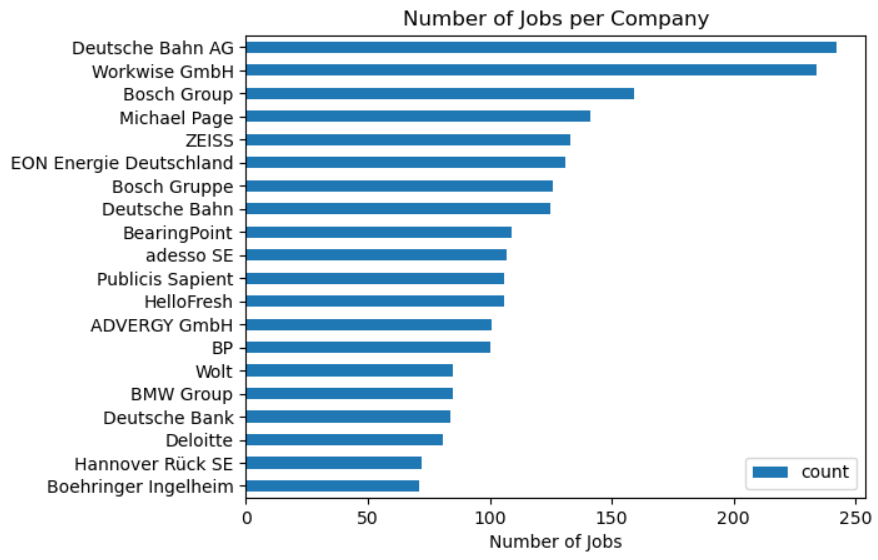

# Overview
Welcome to my analysis of the data job market, focusing on Data Scientist roles. This project was created out of my desire to analyze the job market for Data Scientists in Germany. It delves into the top-paying and in-demand skills to help find optimal job opportunities for data analysts.

The data sourced from Luke Barousse's Python Course which provides a foundation for my analysis. Through a series of Python scripts, I explore key questions such as the most demanded skills, salary trends, and the intersection of demand and salary in Data Science.

# The Analysis


##  Below are the questions I want to answer in my project:

1. What are the skills most in demand for the top 3 most popular Data roles?
2. How are in-demand skills trending for Data Scientists?
3. What are the optimal skills for data analysts to learn? (High Demand and High Paying)


## Tools I Used
For my deep dive into the Data Scientists job market, I harnessed the power of several key tools:

- Python: The backbone of my analysis, allowing me to analyze the data and find critical insights.I also used the following Python libraries:
- Pandas Library: This was used to analyze the data.
- Matplotlib Library: I visualized the data.
- Seaborn Library: Helped me create more advanced visuals.
- Jupyter Notebooks: The tool I used to run my Python scripts which let me easily include my notes and analysis.
- Visual Studio Code: My go-to for executing my Python scripts.
- Git & GitHub: Essential for version control and sharing my Python code and analysis, ensuring collaboration and project tracking.


## Data Preparation and Cleanup
This section outlines the steps taken to prepare the data for analysis, ensuring accuracy and usability.

## Import & Clean Up Data
I start by importing necessary libraries and loading the dataset, followed by initial data cleaning tasks to ensure data quality.

```
import ast
import pandas as pd
import seaborn as sns
from datasets import load_dataset
import matplotlib.pyplot as plt  

# Loading Data
df = pd.read_csv('data_jobs.csv')

# Data Cleanup
df['job_posted_date'] = pd.to_datetime(df['job_posted_date'])
df['job_skills'] = df['job_skills'].apply(lambda x: ast.literal_eval(x) if pd.notna(x) else x)
```

## Filter Germany Jobs
To focus my analysis on the Germant job market, I apply filters to the dataset, narrowing down to roles based in Germany.
```
df_germ = df[(df['job_title_short'] == 'Data Scientist') & (df['job_country'] == 'Germany')].copy()
```

## The Analysis
Each Jupyter notebook for this project aimed at investigating specific aspects of the data job market. Here’s how I approached each question:

### 1. What are the most popular Data Roles in Germany


### Insights

I wanted to get the most popular and in demand Data roles. As we can see, this comprises of Data Analysts, Data Scientists and Data Engineers

Next I decided to find out the comapnies with the largest postings for Data Scientist roles (Which is the focus)


- Here we can see that quite a number of organizations are really hiring for Data scientists

I also wanted to know where most Data Scientists worked from, as it would give an overview of which area of Germany offers the most market


- Berlin, Munich and Hamburg are leading the way

### 2. What are the most demanded skills for the top 3 most popular data roles?

To find the most demanded skills for the top 3 most popular Data roles. I filtered out those positions by which ones were the most popular, and got the top 5 skills for these top 3 roles. This query highlights the most popular job titles and their top skills, showing which skills I should pay attention to depending on the role I'm targeting.

### Results


### Insights

- SQL is actually most requested skill for Data Analysts and Data Scientists.
- Data Engineers require more technical skills (AWS, Azure, Spark) compared to Data Analysts and Data Scientists who are proficient in more general data management and analysis tools (Excel, Tableau).
- Python is a versatile skill, highly demanded across all three roles.

### 3. How are in-demand skills trending for Data Scientists?
To find how skills are trending in 2023 for Data Scientists, I filtered data scientist positions and grouped the skills by the month of the job postings. This got me the top 5 skills by month, showing how popular skills were throughout 2023.

### Results


I was then able to analyse the job postings during the year to see which month has the highest and lowest job postings.This is to give aspiring Data Scientists an overview of the job market in different months


- What we can learn from this is that there a lower demand for data jobs from the months of May, June, July, August
- The Highest demand or job postings range from October to January

### Insights

- Python was in relatively high demand throughout the year, although it regressed a bit from June to September
- This was relatively the same across all skills as the demand reduced


### 4. What are the most optimal skills to learn for Data Scientists?
To identify the most optimal skills to learn ( the ones that are the highest paid and highest in demand) I calculated the percent of skill demand and the median salary of these skills. To easily identify which are the most optimal skills to learn.


# What I Learned
Throughout this project, I deepened my understanding of the data analyst job market and enhanced my technical skills in Python, especially in data manipulation and visualization. Here are a few specific things I learned:

- Advanced Python Usage: Utilizing libraries such as Pandas for data manipulation, Seaborn and Matplotlib for data visualization, and other libraries helped me perform complex data analysis tasks more efficiently.
- Data Cleaning Importance: I learned that thorough data cleaning and preparation are crucial before any analysis can be conducted, ensuring the accuracy of insights derived from the data.
- Strategic Skill Analysis: The project emphasized the importance of aligning one's skills with market demand. Understanding the relationship between skill demand, job availability allows for more strategic career planning in the tech industry.


# Insights
This project provided several general insights into the data job market:

- Skill Demand and Salary Correlation: There is a clear correlation between the demand for specific skills and the salaries these skills command. Advanced and specialized skills like Python and Oracle often lead to higher salaries.
- Market Trends: There are changing trends in skill demand, highlighting the dynamic nature of the data job market. Keeping up with these trends is essential for career growth in data science.
- Economic Value of Skills: Understanding which skills are both in-demand and well-compensated can guide data analysts in prioritizing learning to maximize their economic returns.


# Challenges I Faced
This project was not without its challenges, but it provided good learning opportunities:

- Data Inconsistencies: Handling missing or inconsistent data entries requires careful consideration and thorough data-cleaning techniques to ensure the integrity of the analysis.
- Complex Data Visualization: Designing effective visual representations of complex datasets was challenging but critical for conveying insights clearly and compellingly.


# Conclusion
This exploration into the Data Scientist job market especially in Germany has been incredibly informative, highlighting the critical skills and trends that shape this evolving field. The insights I got enhance my understanding and provide actionable guidance for anyone looking to advance their career in data Science. As the market continues to change, ongoing analysis will be essential to stay ahead in data science. This project is a good foundation for future explorations and underscores the importance of continuous learning and adaptation in the data field.


